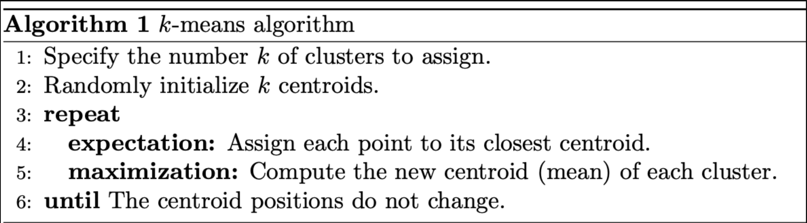
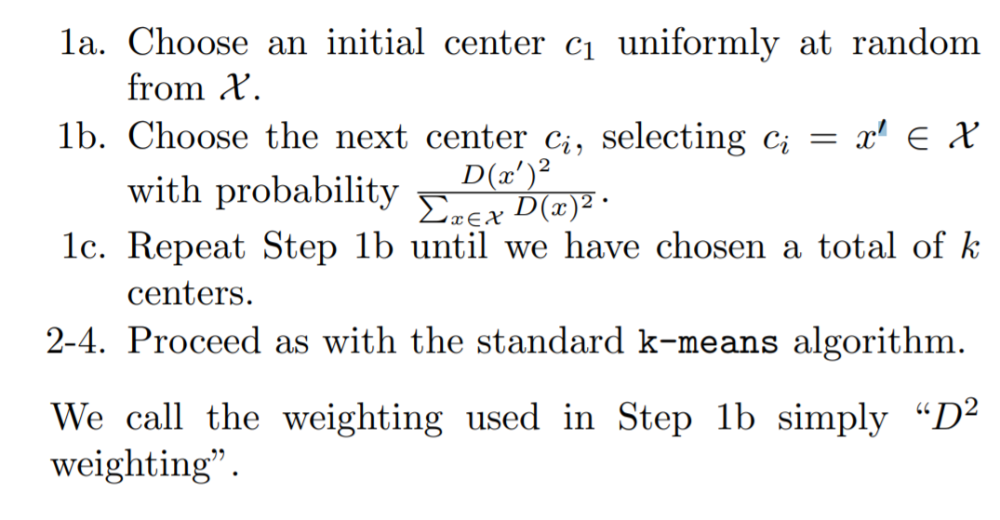
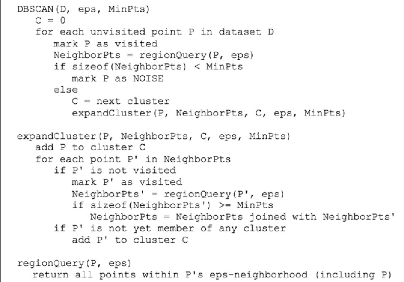

# Clustering-Algorithms

The repo contains implementations and comparison of two clustering algorithms:
- Kmeans++
- DBSCAN

## Dataset
- [Iris](./data/iris.csv)
- [Abalone](./data/abalone.csv)

## Algorithm Concept and Introduction
- [DBSCAN](./DBSCAN_Intro.pptx)
- [Kmeans](./Kmeans_Intro.pptx)

## Algorithm Comparison
- [Kmeans VS DBSCAN](./Kmeans_VS_DBSCAN.ipynb)

## Reference Psuedo Code

### Kmeans

### Kmeans++

### DBSCAN

## Future Work
- Using numpy array instead of list to improve execution time
- Add more arguments and error handling statements to make function more flexible and steady

## Reference
- https://www.researchgate.net/figure/Pseudocode-of-the-DBSCAN-algorithm_fig2_325059373
- https://theory.stanford.edu/~sergei/papers/kMeansPP-soda.pdf
- https://realpython.com/k-means-clustering-python/
